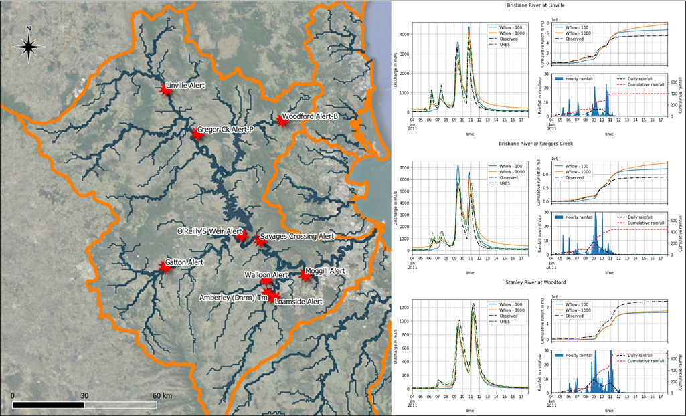
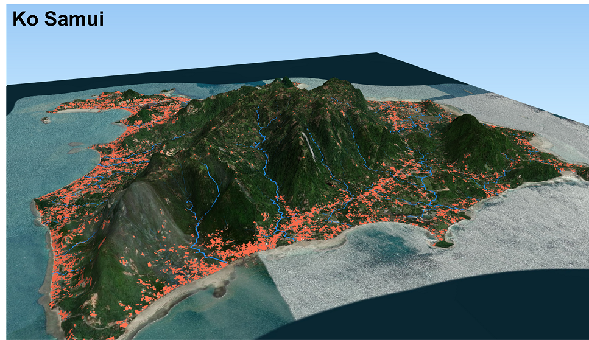
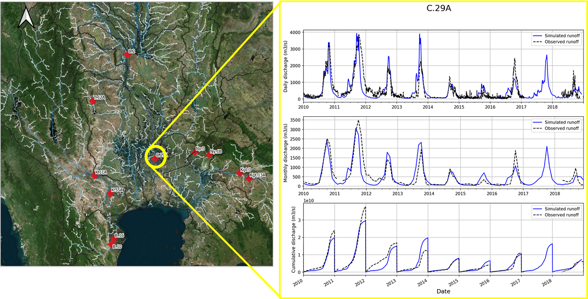

# Case studies

## [Wflow models for the Meuse and Rhine](@id case_rws)

Reliable hydrological models for the Rhine and the Meuse river basin are necessary for short-term forecasting of river flows and long-term predictions for strategic water management planning. In collaboration with Rijkswaterstaat, Deltares is setting-up a new line of models for the Rhine and the Meuse basins. The models will be used for forecasting and to estimate the impact of climate change on water resources and extreme streamflow. In the model development, we seek to improve hydrological predictions by including relevant processes in the model schematization. The modularity of the Wflow framework is ideal for this as we can easily evaluate the combination of different vertical and lateral model components. For example, the local inertial routing for river and overland flow enables us to consider retention of water in the floodplains, which will likely improve extreme streamflow predictions.

## [Operational flood forecasting in Australia](@id case_flifs)

In Australia, there was a need for high-resolution, fast and accurate rainfall-runoff models to provide boundary conditions for a fast and detailled flood inundation model (SFINCS). The domain of the flood model covers there complete North and East coast of Australia. Although many observations stations are available to provide real-time information, many rivers are not covered. For these locations, wflow\_sbm models are used to provide this real-time information. Additionally, these models are used to provide projections for potential future scenarios. Using the HydroMT library, all wflow\_sbm models were automatically build. The high level of flexibility in spatial and temporal resolution, and the physically based nature of the concept make wflow\_sbm a very suitable model for ungauged basins. Furthermore, the model is both detailled and computationally efficient enough in order to be coupled to the fast flood inundation model SFINCS.

The results of this Proof of Concept are very promising. Technically, we were able to very quickly setup the wflow\_sbm models, couple them to the flood inundation models (SFINCS) and run the models operationally under the Delft-FEWS platform. For two basins, model validation was caried out, by comparing the results of wflow\_sbm against the observations and the results of calibrated URBS models. This validation showed that the uncalibrated wflow\_sbm model results were already quite satisfying, especially given the complex nature of these basins, including several small and big reservoirs. We could also demonstrate the potential for further calibration by changing the KsatHorFrac parameter.

Reference: De Kleermaeker, S., Maguire, S., Druery, C., Morales, Y., Lijnse, T., Hegnauer, M., 2022 (in preperation). Developing a real-time data and modelling framework for operational flood inundation forecasting in Australia. Hydrology Water and Resources Symposium.

## [Simulating plastic transport in Thailand](@id case_mfa)

For the Polution Control Board of the Government of Thailand and The World Bank, we supported the material flow analysis of plastics in Thailand using Wflow. Plastic polution is a growing problem globally. Plastic waste enters the rivers and is transported to the ocean where it remains and threatens the health of the ocean, seas and coasts. The initial movement of plastic waste is in many cases triggered by runoff from (heavy) rainfall and with the flow of water transported towards the small stream and rivers. Therefore there is strong relation to rainfall-runoff processes, which allows also to model this process using high-resolution rainfall-runoff models.

In this study we applied the wflow\_sbm model in combination with a fate-and-transport and water quality model (DelWaq) to simulate the movement of plastics through 5 large river basins and on 3 island and coastal zones (Krabi, Phuket and Ko Samui, see screenshot of the model below) in Thailand. Together with our partners Panya Consultants and HII, we were able to show hotspots of plastic polution, how much plastic waste would end up in the Gulf of Thailand and what would be priority areas to adress to reduce plastic waste reaching the sea.

The wflow\_sbm models for the 5 large basins were calibrated. The presence of large dams and reservoirs complicated the calibration, but with the input for the operation of the dams, the model performance for these basins could be largely improved. The figure below shows the calibrated model results for the Chao Phraya, just upstream of Bangkok. The input from the hydrological wflow\_sbm model was used as input for the fate and transport model to assess how much plastic would transported to the ocean.

Link to World Bank report: [https://www.worldbank.org/en/country/thailand/publication/plastic-waste-material-flow-analysis-for-thailand](https://www.worldbank.org/en/country/thailand/publication/plastic-waste-material-flow-analysis-for-thailand)
